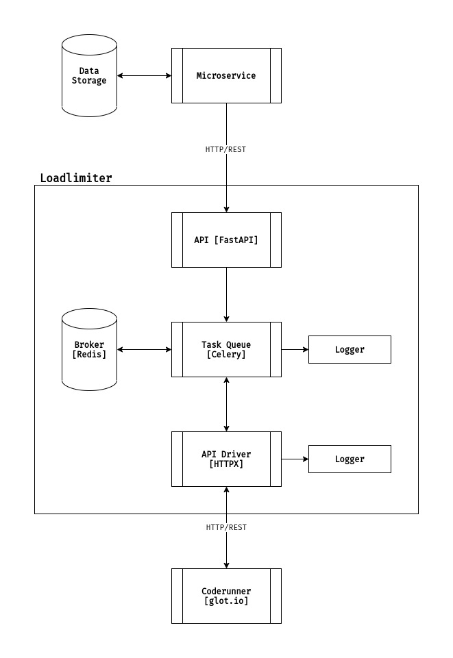

# Coderunner Microservice
Coderunner microservice that enables to run custom source code and get stdout and stderr as a result through REST API.


## Motivation
Main module and basis of microservice on which custom source code runs is [glot.io docker image](https://github.com/glotcode/docker-run). Due to decent [resource consumption](https://github.com/glotcode/docker-run#performance) which is critical for some systems, decision to make this project was made. Basically, project implements custom load-limiter as a wrapper on coderunner, which restricts and limits parallel processing of requests. Simply said, based on machine on which project runs, you can set number of queues - **N**, which means that only **N** requests will be processed in parallel, without ignoring other received requests, which are put into a task queue for later processing. Thus, we avoid overloading the server machine and "crashing" it.


Microservice can be easily customized by sophisticating its processing mechanism. For example, in case if you have high-load project, on which thousands of requests is going to be received at the same time, you can add load-balancer and orchestrator, such as [HashiCorp Consul](https://www.hashicorp.com/products/consul), [HashiCorp Nomad](https://www.hashicorp.com/products/nomad), etc.


Note that the system in which microservice will be used should permit that requests will be processed some time, that depends on multiple factors: machine resources, load-balancing mechanism, orchestration mechanism, etc.


## Tech Stack
- FastAPI - API
- Celery - Task Queue
- Flower - Task Queue Monitoring
- [glot.io](https://github.com/glotcode/glot) - Coderunner
- Docker & docker-compose - Containerization


## Features
- Async API - receives requests from other microservices
- Load-limiting mechanism
- API Driver - sends requests to other microservices
- Logging for Celery and API Driver
- Source code running


## Workflow Scheme



## How to Use

Root directory has docker-compose file through which whole microservice can be started. Build images:
```shell
docker-compose build
```

And start up services:
```shell
docker-compose up
```

Finally after successful start of all services, microservice will accept requests on https://0.0.0.0:8001. API docs on http://0.0.0.0:8001/docs. And main endpoint for running custom source code - http://0.0.0.0:8001/api_v1/run. It demands custom headers for basic secure interaction through microservices - `X-Access-Token`. By default it is `token`, you can customize settings in [API settings](https://github.com/raisultan/coderunner-service/blob/main/loadlimiter/app/config/settings.py).

### Images

Currently project set up to support JavaScript and Python as basis. But you can add your custom images for other programming languages, those can have custom packages installed. It can be implemented by analogy to [coderunner images](https://github.com/raisultan/coderunner-service/tree/main/coderunner) with Nix, you can find full list of supported and ready to use default docker images [here](https://github.com/glotcode/glot-images). It also has initial [startup script](https://github.com/raisultan/coderunner-service/blob/main/coderunner/scripts/check_dependency_images_exist.sh) that checks existence of needed docker images on machine.


## Enhancement, contribution, and feedback
Any feedback or contribution to the project is eagerly welcomed. Just create an issue or contact me on ki.xbozz@gmail.com.
